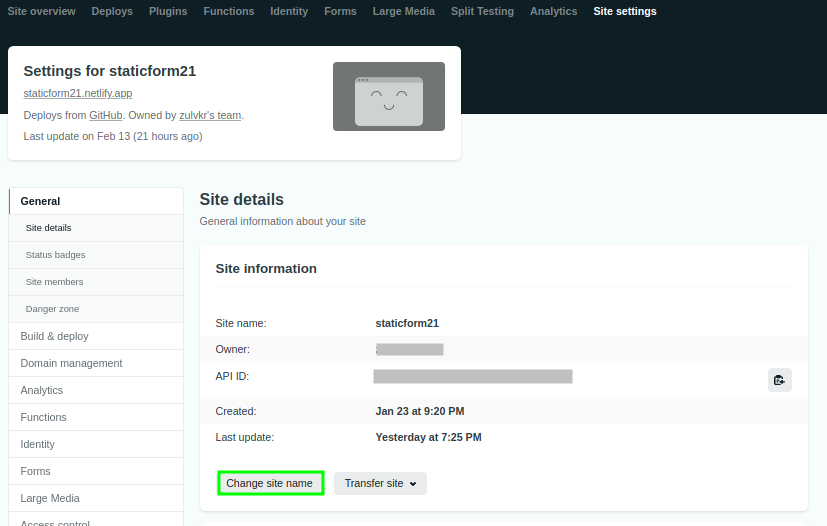

# Change Website URL

Netlify gives you silly random subdomain name when you make a new website, something like *squiggly-super-ha7968.netlify.app*.

It is easy to change the subdomain name by changing your site name to a more memorable one. Go to [Netlify Dashboard](https://app.netlify.com/). Select your site, then open your site settings. Click change site name.

## Use custom domain

Netlify allow you to use custom domain, see [Netlify Docs](https://docs.netlify.com/domains-https/custom-domains/) for more information.