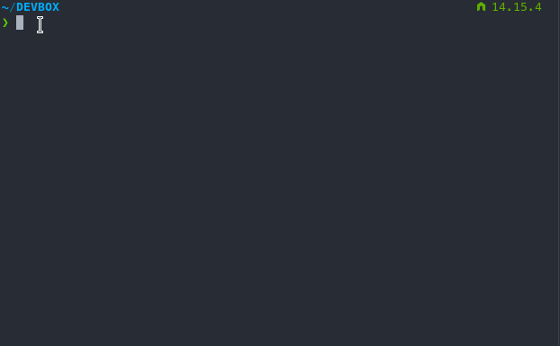
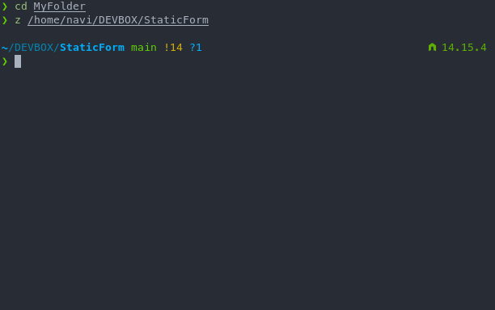

# Local Installation

If you are going to customize your installation, it is more convenient to develop your website locally first and deploy it by pushing to git repository that synced with Netlify. Here we explain it step by step.

## TL;DR

```bash
#clone the repository
git clone https://github.com/zulvkr/StaticForm.git

#install dependencies
cd StaticForm
npm i

#start development server
npm start
```

## Prerequisites

1. A good Unix-like terminal. If you use Windows, [CMDER](https://cmder.net/) with bundled git will do.
2. `git` should be installed.
3. Node.js should be installed. Currently Static Form uses Node 15.5.

## Step by step installation

1. Open terminal.
2. Move to directory where you want to install **Static Form** with `cd` command.

    

    >tips: you can use `tab` to autocomplete a terminal command and double `tab` for suggestion.

3. `clone` this repository to your local system. You should clone your own repository if you used the deploy button.

    ```bash
    git clone https://github.com/zulvkr/StaticForm.git
    ```

4. `cd` to the project folder

    ```bash
    cd StaticForm
    ```

5. Install dependencies

    ```bash
    npm install
    ```

    This command will run Node Package Manager to install all dependencies to `node_modules` directory. You can see all dependencies of this project in `package.json`.

6. Start the development server in your project directory

    ```bash
    npm start
    ```

    This command will start the development server.

    

    Open *localhost:8080* in your browser to see if the server is running properly

    You can stop the server with `Ctrl + C` in the terminal.
