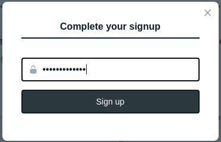

# Getting started

## Prerequisites

* [GitHub](https://github.com/) / [GitLab](https://gitlab.com/) account
* [Netlify](https://app.netlify.com/) account

## Quick deployment

Thanks to Netlify, creating your own instance of Static Form is a one-click:

This button will tell Netlify to make a copy of **Static Form** in your GitHub / GitLab, build the website in their edge server and set up the CI/CD automatically. After deployment, we need to do some configuration to use the admin interface.

## Initial configuration

If you used deploy button, you will receive invitation email to create user. So, accept the invitation on your email, then you will be directed to your new website and asked to create a password.

Sign up complete! Now, go to `admin` page. You should be able to login with your new account.

If you didn't find the invitation or you didn't use the deploy button, you should check the following configuration:

1. [Check if the git-gateway is enabled.](https://docs.netlify.com/visitor-access/git-gateway/)
2. [Check if you have enable Identity](https://docs.netlify.com/visitor-access/identity/)
3. [Check if your email has been invited in Identity](https://docs.netlify.com/visitor-access/identity/registration-login/#invitations)
4. Check if `config.yaml` used correct branch, usually `main`.

## Next Steps

See **User Guide** section for detailed instruction how to use and costumize Static Form. For local development, see [Local Installation](local-installation.md)
